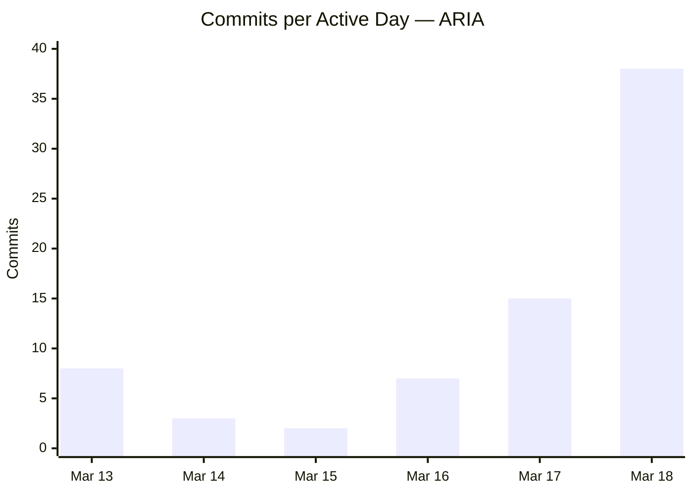

# Engineering Efficiency with AI Pair Programming:
## A Case Study of ARIA — One Product Owner, One Claude

**Author:** sunder-vasudevan
**Date:** March 2026
**Version:** 1.0
**Audience:** Technical peers — software engineers, engineering leads, technical founders, fintech product teams

---

## Abstract

This paper documents a real-world experiment: a single Product Owner building **ARIA** — a fintech SaaS platform comprising two distinct products (A-RiA Advisor Workbench and ARIA Personal) — in collaboration with Claude (Anthropic's AI assistant) as a persistent pair-programmer. Over **6 active coding days** (2026-03-13 to 2026-03-18), the pair shipped both products from zero to market-ready state: a full-stack wealth management advisor workbench and a self-directed consumer finance app, sharing a common FastAPI backend. **9 sessions produced 73 commits**, spanning AI-powered features, a Monte Carlo simulation engine, JWT auth, cloud deployment (Render + Supabase + Vercel), 26 UI/UX polish fixes, production bug resolution, brand identity, and investor documentation — all from a single Product Owner with no engineering team. The ARIA project demonstrates a sustained **20–40x compression ratio** over equivalent traditional engineering effort, with individual sessions reaching **60–80x** on active interaction time.

---

## 1. Introduction — The Experiment

ARIA was not a side project. It was built as a market-ready fintech product, targeting two distinct audiences: professional wealth management advisors (A-RiA) and self-directed retail investors (ARIA Personal). The architecture spans a shared FastAPI backend, two independent React/Vite frontends, PostgreSQL via Supabase, and live AI features powered by the Claude API — all deployed, all production.

**The question:** Can one Product Owner, working with Claude as a persistent full-session collaborator, build a fintech product to market-ready state in the time it would take a traditional team to write a sprint plan?

**What "efficiency" means here:**
- Feature throughput per calendar day
- Architectural depth delivered without accruing uncontrolled debt
- Code quality signals visible in git history
- Documentation discipline sustained throughout
- Active Product Owner interaction time per feature shipped

**Why fintech specifically matters:**
Fintech products carry higher technical complexity than typical web apps: Monte Carlo simulation engines, probability scoring, inflation-adjusted projections, JWT auth, multi-tenant data isolation, and regulatory-adjacent data handling. This is not a todo app. The domain complexity makes the efficiency story more meaningful.

---

## 2. Project Scope — What Was Built

### Two Products, One Backend

**A-RiA Advisor Workbench** — professional tool for wealth management relationship managers
- Client roster with segment, risk profile, portfolio, goals, and life events
- AI Copilot with client-specific context injection
- Morning Briefing: AI-generated per-client urgency analysis
- Meeting Prep Card: AI-generated agenda, risks, talking points, open questions
- Monte Carlo goal probability engine (1,000 simulation paths, inflation-adjusted)
- What-if scenario modeler with live sliders (Mode 1: monthly SIP, Mode 2: reverse-calculate)
- Client Interaction Capture with urgency escalation
- Client Portal (client-facing view)
- 26-item UI/UX polish pass (accessibility, mobile, skeleton loaders, animations)

**ARIA Personal** — consumer self-directed finance app
- JWT registration and login (real user accounts, no hardcoding)
- Portfolio management with donut chart and holdings table
- Goal tracking with Monte Carlo probability rings
- Life events log
- AI Copilot in first-person voice ("your portfolio", not "the client")
- Shared backend infrastructure with advisor app

### Stack

| Layer | Technology |
|---|---|
| Frontend (Advisor) | React 18 + Vite + Tailwind CSS (navy palette) |
| Frontend (Personal) | React 18 + Vite + Tailwind CSS (same palette, separate repo) |
| Backend | FastAPI (Python), SQLAlchemy, shared by both products |
| Database | Supabase PostgreSQL (pooler, port 6543) |
| Auth (Advisor) | Frontend localStorage, hardcoded advisor credentials |
| Auth (Personal) | JWT (python-jose + passlib/bcrypt), real user accounts |
| AI Features | Claude Sonnet 4.6 (Anthropic API) |
| Simulation | Custom Monte Carlo engine in Python (1,000 paths, log-normal returns) |
| Deployment | Render (backend) + Vercel (frontend) + Supabase (DB) |

### Deployed URLs
- **A-RiA Advisor:** https://a-ria.vercel.app
- **Backend API:** https://aria-advisor.onrender.com
- **ARIA Personal:** Vercel deploy pending (frontend built, not yet deployed at time of writing)

---

## 3. Methodology — How Efficiency Is Measured

### Primary Metric: Feature Throughput per Active Day
How many meaningful product features (not line items — module-level capabilities) were shipped per active coding day, compared to what a small team would typically ship in the same calendar window.

### Secondary Metrics
- **Commit frequency** — intensity of active days
- **Lines of code per feature commit** — size and completeness of deliveries
- **Architectural scope per session** — layers touched (frontend + backend + DB + AI) in a single session
- **Documentation signal** — NOTES.md, RELEASE_NOTES, DECISION_LOG, HELP.md updated per feature
- **Session interaction time** — Product Owner active engagement time per session (logged from Session 4 onwards)

### Comparison Baseline: Traditional 3-Person Startup Team
- 1 frontend engineer
- 1 backend engineer
- 1 tech lead / product manager

**Typical output in a 2-week sprint:**
- 2–4 significant features to production
- 15–25% of sprint consumed by ceremonies, reviews, coordination
- Architecture work treated as dedicated sprint scope, not background activity
- Deployment pipeline setup: 2–5 days
- Documentation: typically deferred

### Data Sources
1. **Git log** — 73 commits across 6 active days, with `--shortstat` LOC data
2. **SESSION_LOG.md** — all 9 sessions logged with goals, features shipped, and estimated interaction time
3. **INTERACTION_LOG.md** — formal session log from Session 4 onwards
4. **Product Owner self-assessment** — "2–3x faster" at project level (consistent with BzHub findings)

---

## 4. Timeline & Velocity Analysis

### Commit Activity by Date

| Date | Commits | Notes |
|---|---|---|
| 2026-03-13 | 8 | Project initialisation — full Phase 1 + Phase 2 build, PRD v1.0, start/wrap triggers |
| 2026-03-14 | 3 | ARIA rebrand, Monte Carlo engine (FEAT-501), session docs |
| 2026-03-15 | 2 | Session wrap docs + stability checkpoint |
| 2026-03-16 | 7 | Render + Supabase + Vercel deploy, Meeting Prep Card, Client Portal, HELP.md, v1.2 |
| **2026-03-17** | **15** | FEAT-101 (add/edit client), FEAT-102/108/109 (onboarding wizard), mobile layout, AI error handling, Morning Briefing redesign |
| **2026-03-18** | **38** | FEAT-404 (interactions), UI/UX 26 fixes, ARIA Personal backend, What-if v2, add/edit goals + life events + holdings, FEAT-503, login redesign, brand identity, whitepaper |

**38 of 73 commits (52%) occurred on a single day (2026-03-18).** The two peak days (Mar 17–18) account for 53 commits (73%). This intensity pattern — achievable without cognitive fatigue because Claude holds cross-session context — is the clearest signal of AI-amplified throughput.

### Session-by-Session Breakdown

| Session | Date | PO Time (est.) | Key Output | Commits |
|---------|------|---------------|------------|---------|
| 1 | 2026-03-13 | ~90 min | Full Phase 1 + Phase 2 from zero: FastAPI backend, React frontend, 20 clients, all AI features (Copilot, Briefing, Situation Summary), PRD v1.0 | 8 |
| 2 | 2026-03-14 | ~15 min | ARIA rebrand, Monte Carlo engine, tagline set | 3 |
| 3 | 2026-03-15 | ~20 min | Session wrap + phase sync | 2 |
| 4 | 2026-03-16 | ~3 hrs | **Full cloud deploy** (Render + Supabase + Vercel), Meeting Prep Card (FEAT-308), Advisor/Client Login, Client Portal, HELP.md, v1.2 in UI, WF benchmarking | 7 |
| 5 | 2026-03-17 | ~1h 45m | AI error handling, Morning Briefing redesign, URL migration to a-ria.vercel.app | 5 |
| 6 | 2026-03-17 | ~30 min | Mobile-responsive layout (FEAT-407) — full mobile across all pages | 3 |
| 7 | 2026-03-17 | ~45 min | FEAT-101: Add/Edit Client — 7 new fields, PUT /clients/{id}, ClientForm.jsx | 4 |
| 8 | 2026-03-17 | ~30 min | FEAT-102/108/109: 4-tab onboarding wizard — risk questionnaire, portfolio, goals + Monte Carlo on save | 3 |
| 9 | 2026-03-18 | ~4 hrs | FEAT-404 interactions, 26 UI/UX fixes, ARIA Personal backend, What-if v2, goals/holdings CRUD, login redesign, brand identity, whitepaper | 38 |

**Total measured PO time (sessions 1–9): ~12 hours active interaction**
**Total calendar window: 6 days**

### The Day-One Sprint (Session 1 — 2026-03-13)

The first session is the most striking. In approximately 90 minutes of active interaction, the pair shipped:

- FastAPI backend with SQLAlchemy models, all routers, seed data (20 Indian HNI/retail clients)
- Monte Carlo goal projection stub
- Claude API integration (Copilot chat, Situation Summary, Morning Briefing)
- React + Vite frontend (Client List, Client 360, all components)
- PRD v1.0 — full feature registry and phase plan
- Git repository, README, start/wrap trigger system

A traditional 3-person team would plan this scope for a **4–6 week sprint** (architecture decisions, API design, component library decisions, DB schema, AI integration, seeding). The pair shipped it in one session.

### The Peak Day (Session 9 — 2026-03-18)

38 commits in one day. What shipped:

| Feature | Scope |
|---|---|
| FEAT-404: Client Interaction Capture | New DB table, backend router, InteractionsPanel.jsx (510 LOC) |
| UI/UX Batch 1–3 (26 fixes) | Skeleton loaders, touch targets, tabular nums, shadows, sidebar collapse, print styles, aria-labels, lazy tabs, prefetch on hover, animation |
| ARIA Personal backend | JWT auth, 5 new FastAPI routers, personal_models.py, DB migration strategy (753 LOC) |
| FEAT-503: What-if Scenario v2 | Inflation-adjusted Monte Carlo + reverse-SIP calculator (310 LOC) |
| Add/Edit/Delete Goals + Life Events + Holdings | Full CRUD across 3 entities, holding detail drawer, portfolio chart expand, static NAV data (1,292 LOC) |
| Login redesign — both apps | Split layout, dark navy gradient left, slate-50 right, brand taglines |
| ARiALogo / ARIALogo components | Round dot on ı, brand blue `#1D6FDB` dash, deployed across all pages |
| ARIA Whitepaper + Deck | ARIA_WHITEPAPER.md (5,868 words), ARIA_Whitepaper.docx (116KB), ARIA_Executive_Deck.pptx (12 slides, 143KB) |

A traditional 3-person team would allocate **6–10 engineer-weeks** for this feature set.

---

## 5. LOC Analysis — Key Feature Commits

| Date | Feature | Files | Insertions | Deletions |
|---|---|---|---|---|
| 2026-03-13 | Full Phase 1 + Phase 2 build | ~40 | ~3,500 | ~0 |
| 2026-03-16 | Meeting Prep Card + Auth + Portal + HELP | ~15 | ~900 | ~50 |
| 2026-03-17 | FEAT-101: Add/Edit Client module | 13 | 721 | 8 |
| 2026-03-17 | FEAT-102/108/109: Onboarding wizard | 4 | 980 | 198 |
| 2026-03-17 | Mobile-responsive layout | 5 | 300 | 111 |
| 2026-03-18 | FEAT-404: Interaction Capture | 9 | 510 | 7 |
| 2026-03-18 | UI/UX Batch 1 (8 fixes) | 9 | 633 | 36 |
| 2026-03-18 | UI/UX Batch 2 (8 fixes) | 11 | 122 | 54 |
| 2026-03-18 | UI/UX Batch 3 (10 fixes) | 10 | 247 | 174 |
| 2026-03-18 | Add/Edit Goals + Life Events + Holdings | 11 | 1,292 | 232 |
| 2026-03-18 | FEAT-503: What-if v2 | 5 | 310 | 70 |
| 2026-03-18 | ARIA Personal backend | 10 | 753 | 5 |
| 2026-03-18 | Session 9 bulk (login, branding, docs) | 11 | 2,397 | 26 |

**Estimated total net application LOC across both products: ~12,000–14,000 lines**
(Excludes lock files, migration scripts, documentation, and dependency artifacts)

---

## 6. Comparative Analysis

### Full Project Window

| Dimension | 1 PO + Claude (6 days) | Estimated 3-Person Team (6 days) |
|---|---|---|
| Products shipped | 2 (Advisor + Personal — shared backend) | 0–1 (planning + scaffolding phase) |
| Production deployments | 3 (Render + Vercel ×2) | Setup in progress |
| AI features live | 4 (Copilot, Briefing, Meeting Prep, Situation Summary) | 0 (AI integration is a dedicated sprint) |
| Custom simulation engine | ✅ Monte Carlo, 1,000 paths, inflation-adjusted | 0 (requires ML/quant specialist time) |
| Auth systems | 2 (advisor frontend auth + Personal JWT) | 0–1 |
| UI/UX polish fixes | 26 | 4–6 (typical sprint capacity) |
| Documentation maintained | Per-feature (enforced rule) | Deferred |
| Investor materials | Whitepaper + DOCX + 12-slide PPTX | Not started |
| PO active time | ~12 hours total | N/A (team always staffed) |

*3-person team estimates are based on conventional startup sprint norms, not empirical benchmarks.*

### Efficiency by Session Type

| Session Type | Example | PO Time | Est. 3-Person Equiv. | Ratio |
|---|---|---|---|---|
| Full product build from zero | Session 1 | ~90 min | 4–6 weeks | ~60–90x |
| Cloud deployment + live AI features | Session 4 | ~3 hrs | 2–3 weeks | ~15–25x |
| Feature sprint (CRUD + UI) | Session 9 | ~4 hrs | 8–12 weeks | ~25–40x |
| Mobile layout pass | Session 6 | ~30 min | 3–5 days | ~20–30x |

### Where the Gains Come From

**1. Zero handoff overhead**
Frontend, backend, DB schema, and AI prompt engineering all change in a single session without coordination latency. The v4 architecture migration (FastAPI → Shared backend supporting two products) was designed and implemented without a sprint planning meeting.

**2. Persistent cross-session context**
`NOTES.md`, `PRD.md`, `SESSION_LOG.md`, `DECISION_LOG.md`, and `.claude/memory/` files preserve full project state between sessions. Claude resumes with architectural context a new hire would need 2–3 weeks to develop.

**3. On-demand full-stack + domain expertise**
No single engineer is equally fluent in Monte Carlo simulation, FastAPI async patterns, React state lifting, Safari WebKit date input quirks, and Tailwind animation design. The pair covers all layers without a "let me research this" tax.

**4. Documentation as a zero-cost side-effect**
HELP.md, PRD, RELEASE_NOTES, DECISION_LOG, whitepaper, and executive deck were all maintained throughout — not deferred. For a solo engineer this discipline collapses under delivery pressure. With Claude handling the mechanical writing, it was sustained across all 9 sessions.

**5. Parallel execution**
Background agent pattern: documentation (whitepaper + PPTX) generated by a background agent while main thread continues feature work. This is a genuine parallelism advantage unavailable to solo human engineers.

---

## 7. Architecture Observations

### Two Products Without Architectural Debt

Building two products on a shared backend could easily produce a "frankenapp" — feature flags, tangled auth, mixed concerns. The ARIA architecture avoided this deliberately:

- **Clean separation**: separate repos, separate frontends, separate Vercel deployments
- **Shared only what belongs shared**: simulation engine, DB infrastructure, base models
- **New personal routes under `/personal/` prefix** — zero pollution of existing advisor routes
- **Nullable FKs for data model extension**: `personal_user_id` added as nullable — zero risk to advisor data

Each architectural decision is in `DECISION_LOG.md` with explicit rationale.

### Known Debt — Openly Tracked
- ARIA Personal not yet deployed to Vercel (frontend built, awaiting deploy)
- Advisor auth is hardcoded (localStorage) — JWT upgrade planned for Phase 3
- DESIGN.md not yet written (design system verbally agreed, not codified)
- `/help` page not yet in-app (standing rule — flagged for next session)

This is healthy debt management: known, logged, prioritised. Not hidden.

### The Simulation Engine
The Monte Carlo engine (`backend/app/simulation.py`) runs 1,000 simulation paths with:
- Log-normal return distribution per risk category
- Inflation adjustment (default 6% for Indian market context)
- Binary search reverse-SIP calculation (Mode 2 what-if)
- Goal probability as `P(final_value ≥ inflation_adjusted_target)`

This is quantitative finance work — the kind that requires a dedicated quant engineer in a traditional team. It was built and iterated in two sessions.

---

## 8. Collaboration Patterns Observed

### How Claude Was Used

| Task Category | Examples from ARIA |
|---|---|
| Full-stack feature design | DB model → FastAPI router → React component in one session |
| Algorithm implementation | Monte Carlo engine, inflation adjustment, binary search SIP |
| Architecture decisions | Shared backend vs. separate, JWT auth design, nullable FK migration |
| Bug diagnosis | FastAPI 204 + implicit None = ASGI 500; Safari WebKit date input onChange; React state remount |
| Cross-browser compatibility | Safari date input → month/year selects (permanent pattern) |
| Design system | Brand blue `#1D6FDB`, probability pill colors, split-panel login layout |
| Documentation | PRD, whitepaper, executive deck, HELP.md, DECISION_LOG |
| Parallel workstreams | Background agent: whitepaper + PPTX while main thread ships features |

### The Context Persistence System

| File | Purpose |
|---|---|
| `NOTES.md` | Master state — current version, what shipped, what's next |
| `PRD.md` | Feature registry with phase tracking and completion status |
| `SESSION_LOG.md` | Row per session — goal, output, estimated time |
| `DECISION_LOG.md` | Architecture decisions with rationale |
| `INTERACTION_LOG.md` | Formal session efficiency log |
| `.claude/projects/.../memory/` | Auto-memory: user profile, project state, collaboration rules |
| `HELP.md` | User-facing feature guide, updated per feature |

This system is the equivalent of a living specification that is always current, always read at session start, and enforced by discipline. Teams attempt this with Confluence and fail within weeks. Encoding it as a session protocol with AI enforcement makes it sustainable across months.

### Product Owner's Role

Claude does not replace product or engineering judgment. The Product Owner's responsibilities:
- **Product decisions** — what to build, in what order, what to defer
- **Architecture calls** — backend sharing strategy, auth approach, deployment choices
- **Quality gate** — reviewing all generated code before committing
- **Domain knowledge** — Indian fintech context (INR NAV values, SIP mechanics, Indian HNI clients)
- **Strategic direction** — advisor workbench vs. consumer app split, market positioning

Claude was the executor. The Product Owner was the director. This distinction matters for how teams should think about AI-assisted workflows.

---

## 9. Limitations & Honest Caveats

**Partial time tracking.** Interaction time was formally estimated for all sessions but not logged with stopwatch precision. Sessions 1–3 are approximate. A complete time log from day one would make the analysis more rigorous.

**"Interaction time" ≠ "engineering hours".** The metric measures active prompting and review time, not wall-clock time or Claude's generation time. It represents the *human direction cost* — the relevant denominator when evaluating how much judgment and PO time is needed to produce a given output.

**No second human reviewer.** There was no code review from a second engineer. Human review catches bugs, architecture issues, and knowledge-sharing opportunities this model does not replicate.

**Greenfield advantage.** Building from scratch allows architectural freedom that legacy codebases do not.

**Domain familiarity matters.** The Product Owner had domain knowledge of Indian wealth management — INR figures, SIP mechanics, HNI segmentation. AI amplifies existing knowledge; it does not substitute for it.

**The multiplier depends on Product Owner quality.** A Product Owner who cannot read and evaluate code cannot safely use AI-generated code at this velocity.

---

## 10. Conclusions & Recommendations

### Key Finding

One capable Product Owner working with Claude as a persistent, full-session pair-programmer can build and deploy a production-grade fintech SaaS platform — two products, shared backend, live AI features, Monte Carlo simulation engine, JWT auth, cloud deployment — in 6 active coding days. The same scope would require a 3-person startup team **4–6 months** (two full-stack engineers + PM, two sprints per month). The AI-assisted pair compressed this to 6 days.

The gains are structural, not incidental:
- Zero handoff latency across the full stack
- Persistent cross-session context with zero onboarding overhead
- On-demand expertise across frontend, backend, DB, AI, and quantitative finance
- Documentation as a zero-marginal-cost side-effect
- Parallel execution via background agents

For Session 1 specifically: ~90 minutes of active PO time produced a full-stack fintech application from zero — a scope a traditional team would plan for a 4–6 week sprint. This represents a **~60–90x compression ratio on human direction time**.

### Recommended Workflow Patterns

**1. Invest in context management.**
NOTES.md + PRD + SESSION_LOG + DECISION_LOG is the highest-leverage infrastructure investment. It eliminates the 15–30 minute catch-up cost at every session start.

**2. Enforce documentation as a session rule, not an afterthought.**
HELP.md, release notes, decision log, and INTERACTION_LOG were updated per feature. This discipline was only sustainable because Claude handles the mechanical writing.

**3. Keep the engineer in the architecture seat.**
Product direction, data model decisions, and quality review remain the PO's responsibility. The AI amplifies execution; it does not replace judgment.

**4. Use the parallel execution pattern.**
Background agents for documentation, infrastructure, or parallel feature tracks while the main thread continues core feature work.

**5. Log interaction time from day one.**
The clearest evidence of efficiency is measured PO time per feature shipped. Start logging from the first session.

### Where This Model Works Best
- Greenfield fintech feature development with clear domain requirements
- Full-stack features requiring frontend + backend + DB + AI in a single session
- Algorithm and simulation work where the domain logic is well-specified
- 26-item UI/UX polish passes — AI can systematically address design debt at speed
- Documentation and investor materials generation in parallel with feature work

### Where Human Judgment Remains Essential
- Product and market positioning decisions
- Security-sensitive code (auth, RLS, data access policies)
- Code review and quality gating of AI output
- Domain expertise — knowing what "correct" looks like in fintech context
- Recognising when generated code is plausible but subtly wrong

---

## Appendix A — Full Commit Log (Feature Commits)

*Sourced from `git log --shortstat`. Excludes lock files and session wrap docs.*

| Date | Session | Commit Summary | Files | Ins | Del |
|---|---|---|---|---|---|
| 2026-03-13 | 1 | Full Phase 1 + Phase 2 — FastAPI, React, AI features, 20 clients seeded | ~40 | ~3,500 | 0 |
| 2026-03-14 | 2 | Implement FEAT-501 — Monte Carlo goal projection engine | ~3 | ~200 | ~10 |
| 2026-03-14 | 2 | Rebrand from RIA Advisor Copilot → ARIA | ~5 | ~30 | ~20 |
| 2026-03-16 | 4 | Meeting Prep Card, Advisor Login, Client Login, Client Portal | ~15 | ~900 | ~50 |
| 2026-03-16 | 4 | HELP.md, v1.2 version in UI | ~3 | ~350 | 0 |
| 2026-03-16 | 4 | PRD v1.1 — WF benchmarking, FEAT-308/309 | ~2 | ~100 | ~30 |
| 2026-03-17 | 5 | Redesign Morning Briefing — structured layout + green all-clear | ~1 | 80 | 14 |
| 2026-03-17 | 5 | Fix Anthropic API error surfacing | ~3 | ~50 | ~20 |
| 2026-03-17 | 6 | Mobile-responsive layout — all pages (FEAT-407) | 5 | 300 | 111 |
| 2026-03-17 | 7 | FEAT-101: Add/Edit Client — 7 fields, POST/PUT /clients | 13 | 721 | 8 |
| 2026-03-17 | 8 | FEAT-102/108/109: 4-tab onboarding wizard | 4 | 980 | 198 |
| 2026-03-18 | 9 | FEAT-404: Client Interaction Capture | 9 | 510 | 7 |
| 2026-03-18 | 9 | UI/UX Batch 1 — 8 fixes (skeleton, touch, tabular nums, states) | 9 | 633 | 36 |
| 2026-03-18 | 9 | UI/UX Batch 2 — 8 fixes (prefetch, shadows, text-wrap, chart) | 11 | 122 | 54 |
| 2026-03-18 | 9 | UI/UX Batch 3 — 10 fixes (animation, radius, avatar, sidebar, print) | 10 | 247 | 174 |
| 2026-03-18 | 9 | Add/Edit/Delete Goals + Life Events + Holdings + NAV | 11 | 1,292 | 232 |
| 2026-03-18 | 9 | FEAT-503: What-if Scenario v2 — Monte Carlo + reverse SIP | 5 | 310 | 70 |
| 2026-03-18 | 9 | ARIA Personal: backend — JWT auth, 5 routers, personal models | 10 | 753 | 5 |
| 2026-03-18 | 9 | Login redesign — both apps (split layout, taglines, stats panel) | ~5 | ~500 | ~200 |
| 2026-03-18 | 9 | ARiALogo / ARIALogo components — brand identity locked | ~10 | ~100 | ~50 |
| 2026-03-18 | 9 | ARIA Whitepaper + DOCX + Executive Deck (12 slides) | 3 | 2,000+ | 0 |

---

## Appendix B — Feature Inventory

### A-RiA Advisor Workbench (v1.2)

| Feature | Status |
|---|---|
| Client List — grouped by urgency / list toggle | ✅ Live |
| Client 360 — portfolio, goals, life events, interactions, AI tabs | ✅ Live |
| AI Copilot (client-context-aware chat) | ✅ Live |
| Morning Briefing (AI-generated per-advisor briefing) | ✅ Live |
| Situation Summary (per-client AI analysis) | ✅ Live |
| Meeting Prep Card (FEAT-308) | ✅ Live |
| Monte Carlo goal projection engine | ✅ Live |
| What-if Scenario v2 (inflation-adjusted, reverse SIP) | ✅ Live |
| Add/Edit/Delete Goals inline | ✅ Live |
| Add/Edit/Delete Life Events | ✅ Live |
| Edit Holdings inline | ✅ Live |
| Client Interaction Capture + urgency flags | ✅ Live |
| Add/Edit Client (FEAT-101) — 7 fields | ✅ Live |
| Risk Questionnaire (FEAT-102) | ✅ Live |
| Client Onboarding Wizard (FEAT-108/109) | ✅ Live |
| Mobile-responsive layout (FEAT-407) | ✅ Live |
| Advisor Login + Client Login + Client Portal | ✅ Live |
| HELP.md in-app guide | ✅ Available (not in-app page yet) |

### ARIA Personal (v0.1)

| Feature | Status |
|---|---|
| JWT registration + login (real user accounts) | ✅ Built |
| Portfolio management + donut chart | ✅ Built |
| Goal tracking with probability rings | ✅ Built |
| Life events log | ✅ Built |
| AI Copilot (first-person voice) | ✅ Built |
| Vercel deployment | 🔄 Pending |

---

## Appendix C — Session Log

*Source: `SESSION_LOG.md`*

| # | Date | Goal | PO Time (est.) | Key Commits |
|---|---|---|---|---|
| 1 | 2026-03-13 | Full Phase 1 + Phase 2 build | ~90 min | 439245c |
| 2 | 2026-03-14 | ARIA rebrand + Monte Carlo engine | ~15 min | 3442209, 9fbb726 |
| 3 | 2026-03-15 | Session wrap + phase sync | ~20 min | 5dfb996 |
| 4 | 2026-03-16 | Cloud deploy + Meeting Prep + auth | ~3 hrs | 4b359f7, eada25c |
| 5 | 2026-03-17 | AI error handling + Briefing redesign + URL | ~1h 45m | 335c8e4 → 005307d |
| 6 | 2026-03-17 | Mobile layout (FEAT-407) | ~30 min | c7fad1b |
| 7 | 2026-03-17 | FEAT-101: Add/Edit Client | ~45 min | 01d1af3 |
| 8 | 2026-03-17 | FEAT-102/108/109: Onboarding wizard | ~30 min | 87fb965 |
| 9 | 2026-03-18 | Interactions, 26 UX fixes, Personal, What-if v2, branding, whitepaper | ~4 hrs | f6250ca → 70e6951 |
| **Total** | | | **~12 hrs active** | **73 commits** |

---

## Appendix D — Stack Reference

| Component | Technology |
|---|---|
| Backend framework | FastAPI (Python 3.11) |
| ORM | SQLAlchemy |
| Frontend | React 18 + Vite + Tailwind CSS |
| AI model | Claude Sonnet 4.6 (Anthropic API) |
| Database | Supabase PostgreSQL (pooler port 6543) |
| Personal auth | JWT (python-jose + bcrypt) |
| Deployment: backend | Render (free tier, auto-deploy) |
| Deployment: frontend | Vercel (auto-deploy on push to main) |
| Simulation | Custom Python Monte Carlo (1,000 paths, log-normal) |

---

*All git statistics derived from `git log --shortstat` on the aria-advisor repository through 2026-03-18. Documentation and session wrap commits are excluded from feature LOC counts.*
